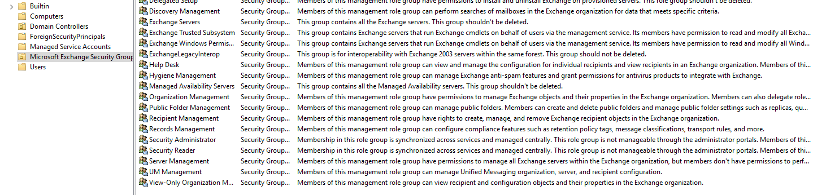

# Установка Exchange Server

## Проверка уровня домена и леса

```powershell

# Импорт модуля Active Directory
Import-Module ActiveDirectory

# Получение информации о текущем домене
$domainInfo = Get-ADDomain

# Вывод уровня функциональности домена
Write-Host "Уровень функциональности домена: $($domainInfo.DomainMode)"


# Получение информации о текущем лесе
$forestInfo = Get-ADForest

# Вывод уровня функциональности леса
Write-Host "Уровень функциональности леса: $($forestInfo.ForestMode)"
```

## Ввод почтового сервера в домен

```powershell
add-computer -DomainName domain.ru -credential domain\Administrator
```

## Установка необходимых компонентов

```powershell
Install-WindowsFeature NET-Framework-45-Core, NET-Framework-45-ASPNET, NET-WCF-HTTP-Activation45, NET-WCF-Pipe-Activation45, NET-WCF-TCP-Activation45, NET-WCF-TCP-PortSharing45, Server-Media-Foundation, RPC-over-HTTP-proxy, RSAT-Clustering, RSAT-Clustering-CmdInterface, RSAT-Clustering-Mgmt, RSAT-Clustering-PowerShell, WAS-Process-Model, Web-Asp-Net45, Web-Basic-Auth, Web-Client-Auth, Web-Digest-Auth, Web-Dir-Browsing, Web-Dyn-Compression, Web-Http-Errors, Web-Http-Logging, Web-Http-Redirect, Web-Http-Tracing, Web-ISAPI-Ext, Web-ISAPI-Filter, Web-Lgcy-Mgmt-Console, Web-Metabase, Web-Mgmt-Console, Web-Mgmt-Service, Web-Net-Ext45, Web-Request-Monitor, Web-Server, Web-Stat-Compression, Web-Static-Content, Web-Windows-Auth, Web-WMI, Windows-Identity-Foundation, RSAT-ADDS
```

Установите следующее программное обеспечение по порядку:

- .NET Framework 4.8

!!! note "Примечание"
    Проверка минимальной необходимой версии .NET Framework путем запроса к реестру в PowerShell (.NET Framework 4.5 и более поздние версии).

    В приведенном ниже примере проверяется значение ключевого слова Release для определения того, установлена ли версия .NET Framework 4.6.2 или более поздняя, вне зависимости от версии Windows (если да, возвращается значение True; в противном случае возвращается значение False). 
    ```powershell
    Get-ChildItem "HKLM:SOFTWARE\Microsoft\NET Framework Setup\NDP\v4\Full\" | Get-ItemPropertyValue -Name Release | ForEach-Object { $_ -ge 528049 }  
    ```
    Значение 528049 в предыдущем примере можно заменить на другое значение из приведенной ниже таблицы для проверки наличия другой версии .NET Framework. 
    
    |Версия	|Минимальное значение DWORD "Release"| 
    |--------|-----------------------------------
    |.NET Framework 4,5		|378389 |
    |.NET Framework 4.5.1	|378675 |
    |.NET Framework 4.5.2	|379893 |
    |.NET Framework 4.6		|393295 |
    |.NET Framework 4.6.1	|394254 |
    |.NET Framework 4.6.2	|394802 |
    |.NET Framework 4.7		|460798 |
    |.NET Framework 4.7.1	|461308 |
    |.NET Framework 4.8		|528049 |


- Распространяемый пакет Visual C++ для Visual Studio 2012

- Пакет Распространяемый компонент Visual C++ для Visual Studio 2013

!!! note "Примечание"
    
    В требованиях к системе для распространяемого пакета Visual C++ не упоминается поддержка Windows Server 2016, Windows Server 2019 или Windows Server 2022, но можно безопасно устанавливать этот распространяемый пакет в этих версиях Windows.
    
    Обзор актуальных поддерживаемых версий: версии распространяемого пакета Visual C++.

    Только для роли почтового ящика требуются пакеты Распространяемый компонент Visual C++ для Visual Studio 2013. Для других установок Exchange (средства управления и пограничный транспортный сервер) требуются только распространяемые пакеты Visual C++ для Visual Studio 2012.

- Модуль перезаписи URL-адресов IIS

!!! note "Примечание"

    Модуль перезаписи URL-адресов IIS требуется с накопительным обновлением 22 или более поздней версии.

* Microsoft Unified Communications Managed API 4.0, среда выполнения для Core (64-разрядная версия)

Проверяем обновления компьютера

## Права учетной записи

Для учетной записи, которая используется для установки Exchange, нужны следующие разрешения: 

* Членство в группе администраторов организации (Enterprise Admins). Обязательно, если это первый сервер Exchange Server в организации.

* Членство в группе администраторов схемы (Schema Admins). Обязательно, если вы еще не расширили схему Active Directory или не подготовили Active Directory для Exchange.

* Членство в группе ролей управления организацией Exchange. Обязательно, если вы уже подготовили домен Active Directory, который будет содержать сервер Exchange Server, либо в организации уже есть другие серверы Exchange Server

```powershell 

# Задаем учетные данные для подключения к домену
$adminUsername = "domain\administrator"
$adminPassword = ConvertTo-SecureString "password" -AsPlainText -Force
$credential = New-Object System.Management.Automation.PSCredential -ArgumentList $adminUsername, $adminPassword

# Загружаем модуль Active Directory
Import-Module ActiveDirectory

# Создаем нового пользователя с указанием пароля
New-ADUser -SamAccountName $username -UserPrincipalName "$username@domain.ru" -Name $username -GivenName $username -Surname "User" -Enabled $true -AccountPassword (ConvertTo-SecureString -AsPlainText $password -Force) -PassThru -Credential $credential

# Добавляем пользователя в группу Schema Admins
Add-ADGroupMember -Identity "Schema Admins" -Members $username -Credential $credential

# Добавляем пользователя в группу Enterprise Admins
Add-ADGroupMember -Identity "Enterprise Admins" -Members $username -Credential $credential

# Добавляем пользователя в группу Domain Admins #для удаленного подключения по rdp
Add-ADGroupMember -Identity "Domain Admins" -Members $username -Credential $credential

Write-Host "Пользователь $username успешно создан и добавлен в группы Schema Admins, Enterprise Admins и Domain Admins."
```

## Подготовка к установке

### Расширение схемы 

```powershell
D:\Setup.exe /IAcceptExchangeServerLicenseTerms_DiagnosticDataON /PrepareSchema
```
На выходе получим

```pwsh-session
Windows PowerShell
Copyright (C) 2016 Microsoft Corporation. All rights reserved.

PS C:\Windows\system32> D:\Setup.exe /IAcceptExchangeServerLicenseTerms_DiagnosticDataON /PrepareSchema

Microsoft Exchange Server 2016 Cumulative Update 23 Unattended Setup

Copying Files...
File copy complete. Setup will now collect additional information needed for installation.


Performing Microsoft Exchange Server Prerequisite Check

    Prerequisite Analysis                                                                                                                                                                                         COMPLETED

Configuring Microsoft Exchange Server

    Extending Active Directory schema                                                                                                                                                                             COMPLETED

The Exchange Server setup operation completed successfully.
PS C:\Windows\system32>
```
Чтобы проверить, что схема была расширена надо запустить редактор ADSI 
``` 
adsiedit.msc
```
подключиться к схеме и убедиться, что появились объекты начинающиеся с CN=ms-Exch
### Подготовка Active Directory
```
D:\Setup.exe /IAcceptExchangeServerLicenseTerms_DiagnosticDataON /PrepareAD /OrganizationName:"yourOrganizationName"
```
Результат корректного выполнения команды
``` pwsh-session
PS C:\Windows\system32> D:\Setup.exe /IAcceptExchangeServerLicenseTerms_DiagnosticDataON /PrepareAD /OrganizationName:"yourOrganizationName"

Microsoft Exchange Server 2016 Cumulative Update 23 Unattended Setup

Copying Files...
File copy complete. Setup will now collect additional information needed for installation.


Performing Microsoft Exchange Server Prerequisite Check

    Prerequisite Analysis                                                                                                                                                                                         100%

Setup will prepare the organization for Exchange Server 2016 by using 'Setup /PrepareAD'. No Exchange Server 2013 roles have been detected in this topology. After this operation, you will not be able to install any Exchange
Server 2013 roles.
For more information, visit: https://docs.microsoft.com/Exchange/plan-and-deploy/deployment-ref/readiness-checks?view=exchserver-2016

Setup will prepare the organization for Exchange Server 2016 by using 'Setup /PrepareAD'. No Exchange Server 2010 roles have been detected in this topology. After this operation, you will not be able to install any Exchange
Server 2010 roles.
For more information, visit: https://docs.microsoft.com/Exchange/plan-and-deploy/deployment-ref/readiness-checks?view=exchserver-2016


Configuring Microsoft Exchange Server

    Organization Preparation                                                                                                                                                                                      COMPLETED

The Exchange Server setup operation completed successfully.
PS C:\Windows\system32>
```
После этого в конфигурации через ADSI edit появляются сервисы Microsoft Exchange 
.png)

И также подразделение Microsoft Exchange Security Groups в Active Directory Users and Computers



### Подготовка всех доменов в лесу
```
D:\Setup.exe /IAcceptExchangeServerLicenseTerms_DiagnosticDataON /PrepareAllDomains
```
Результат

``` pwsh-session
PS C:\Windows\system32> D:\Setup.exe /IAcceptExchangeServerLicenseTerms_DiagnosticDataON /PrepareAllDomains

Microsoft Exchange Server 2016 Cumulative Update 23 Unattended Setup

Copying Files...
File copy complete. Setup will now collect additional information needed for installation.


Performing Microsoft Exchange Server Prerequisite Check

    Prerequisite Analysis                                                                  COMPLETED

Configuring Microsoft Exchange Server

    Prepare Domain Progress                                                                COMPLETED

The Exchange Server setup operation completed successfully.
PS C:\Windows\system32>
```
Проверка 

``` powershell
# Exchange Schema Version
$sc = (Get-ADRootDSE).SchemaNamingContext
$ob = "CN=ms-Exch-Schema-Version-Pt," + $sc
Write-Output "RangeUpper: $((Get-ADObject $ob -pr rangeUpper).rangeUpper)"

# Exchange Object Version (domain)
$dc = (Get-ADRootDSE).DefaultNamingContext
$ob = "CN=Microsoft Exchange System Objects," + $dc
Write-Output "ObjectVersion (Default): $((Get-ADObject $ob -pr objectVersion).objectVersion)"

# Exchange Object Version (forest)
$cc = (Get-ADRootDSE).ConfigurationNamingContext
$fl = "(objectClass=msExchOrganizationContainer)"
Write-Output "ObjectVersion (Configuration): $((Get-ADObject -LDAPFilter $fl -SearchBase $cc -pr objectVersion).objectVersion)"

```
Для версии Exchange 2016 CU23 значения следующие
``` pwsh-session
RangeUpper: 15334
ObjectVersion (Default): 13243
ObjectVersion (Configuration): 16223
```
Информация о [других версияx](https://learn.microsoft.com/ru-ru/exchange/plan-and-deploy/prepare-ad-and-domains?view=exchserver-2016) внизу страницы по ссылке. 

## Установка
Установку проще производить из графического интерфейса

#