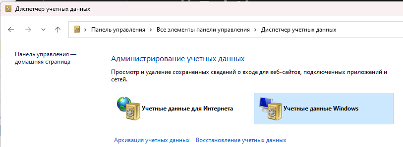

# Синхронизация бесед Skype for Business 2015 в другую учетную запись

## Проблема: 
Пользователю в Outlook подключили дополнительную учётную запись используя логин и пароль и в Журнал Бесед этой дополнительной учётки начали синхронизироваться беседы основного  пользователя. 

## Причина
Неправильное подключение дополнительной учетной записи.

## Решение
Необходимо подключать дополнительные учётные записи выдавая права Full Access используя Exchange Management Shell, и удалить учетные данные от второго аккаунта с компьютеров, где работал пользователь.

### Установка разрешений на отправку почты

``` Powershell
Add-MailboxPermission -Identity bbb@test.com -User aaa@test.com -AccessRights FullAccess -AutoMapping:$true
```
!!! note "Примечание"

    Данная команда добавляет разрешение на полный доступ к почтовому ящику bbb@test.com для пользователя aaa@test.com, и при этом автоматически настраивает сопоставление этого почтового ящика в Outlook пользователя.
    ```powershell
    Add-MailboxPermission 
    ```
    Это команда для добавления разрешений на почтовый ящик.

    ``` Powershell
    -Identity bbb@test.com
    ```
     Эта часть указывает почтовый ящик, к которому вы хотите добавить разрешение. В данном случае, почтовый ящик с адресом bbb@test.com.

    ``` Powershell
    -User aaa@test.com 
    ```
    Здесь указывается пользователь, которому вы предоставляете разрешение. В данном случае, пользователь с адресом aaa@test.com.

    ``` Powershell    
    -AccessRights FullAccess 
    ```
    Этот параметр определяет уровень доступа, предоставляемый пользователю. В данном случае, предоставляется полный доступ к почтовому ящику (FullAccess).

    ``` Powershell    
    -AutoMapping:$true
    ```
    Этот параметр отвечает за автоматическое сопоставление почтового ящика с учетной записью пользователя в Outlook. Когда устанавливается в $true, Outlook автоматически добавляет почтовый ящик в профиль пользователя. Если бы параметр был установлен в $false, пользователь должен был бы добавить почтовый ящик вручную.
    

!!! info "Информация"
    В локальной организации Exchange Server  придется подождать до двух часов или перезапустить службу Exchange Information Store, чтобы изменения распространились.

    Если при попытке отправить сообщение электронной почты от имени другого пользователя появляется следующее сообщение об ошибке:
    ```
    You do not have permission to send to this recipient. 
    For assistance, contact your system administrator.
    ```
    или
    ```
    You can't send a message on behalf of this user unless you have permission to do so.
    ```
    Необходимо:

    Отправить электронное письмо от имени почтового ящика OWA;
    Если удалось отправить сообщение электронной почты из OWA, попробуйте удалить автономную адресную книгу OAB, 
    ```
    C:\Users\%username%\AppData\Local\Microsoft\Outlook\Offline Address Books
    ```
     когда Outlook на рабочем столе не запущен.
     Если пользователь от имени которого делается попытка отправить сообщение, скрыт в адресной книге, то через Outlook не удавалось отправлять сообщения от данного пользователя пока его не включили в отображаемых пользователей адресной книги.

### Удаление сохраненных данных
Чтобы удалить беседы необходимо удалить в Credential Manager данные той учётной записи, которую подключали в Outlook и в которую беседы синхронизируются.



И дополнительно может потребоваться удалить данные чужой учётки в C:\Users\<username>\AppData\Local\Microsoft\Outlook.

Экстремальный способ избавиться от проблемы: пересоздать профиль Windows пользователю, чьи беседы синхронизируются в чужую учётку.

