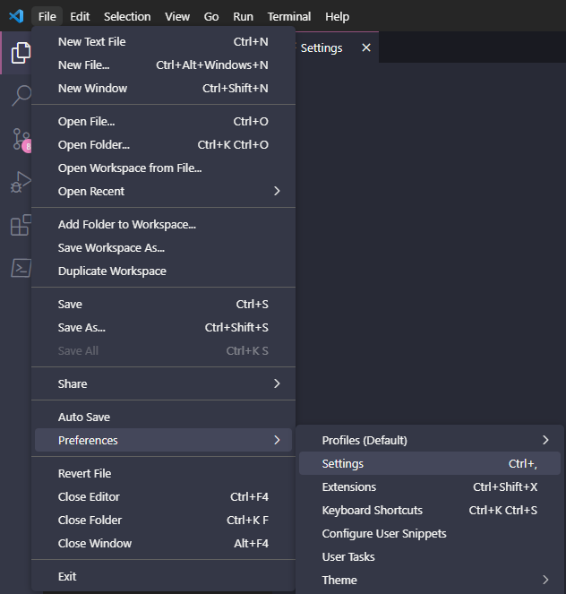
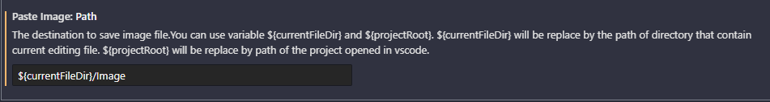
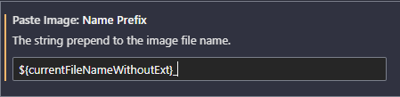

# Плагины для VS code

## Paste Image
Плагин [Paste Image](https://marketplace.visualstudio.com/items?itemName=mushan.vscode-paste-image) для вставки скринов из памяти сразу в файл MkDocs.   
Вставка производится с помощью сочетания клавиш ++ctrl+alt+v++  
Скрин в Windows 11 можно сделать с помощью клавиши ++print-screen++
### Настройки Paste Image
В настройках плагина можно задать папку куда будут сохраняться фото. Я выбрал настройку относительно текущего расположения файла. Для этого в VS code открываем Settings (File - Preference Settings ) или сочетание клавишь ++ctrl+comma++



#### Paste Image: Path
В параметре Paste Image: Path указываем папку в которую, относительно открытого файла будут сохраняться скрины. По умолчанию он забрасывает скрин в туже папку, где находится файл, в который производится вставка. Чтобы указать папку Image нужно в параметре Paste Image: Path указать: 
```
${currentFileDir}/Image
```


#### Paste Image: Name Prefix
Чтобы в будущем понимать скрины из какого файла лежат в папке с изображениями можно задать префикс в параметре Paste Image: Name Prefix

```
${currentFileNameWithoutExt}_
```

