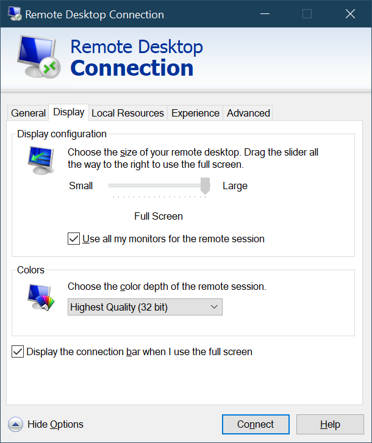
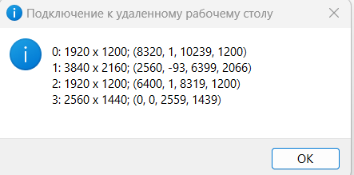

# Использование части мониторов в RDP
С помощью графического интерфеса возможно использовать только сразу все мониторы.  




Оказалось, что охватить _n_ мониторов, но этого нет в графическом интерфейсе.

Сохраните ваш RDP-файл и откройте его в Блокноте. RDP-файл у всех разный, но ваш может выглядеть так:

`full address:s:x.x.x.x:3389`

`prompt` `for` `credentials:i:1`

`administrative session:i:1`

`screen mode id:i:2`

`span monitors:i:1`

`use multimon:i:1`

`selectedmonitors:s:0,1`

Отредактируйте `selectedmonitors:s:x,y` указав мониторы в нужном порядке. Чтобы перечислить все мониторы на моем компьютере нужно использовать команду:
``` cmd
mstsc /l
``` 


  


Для вывода на экран 2, 3 и 4 мониторов я использовал  
```
selectedmonitors:s:1,2,0
```

