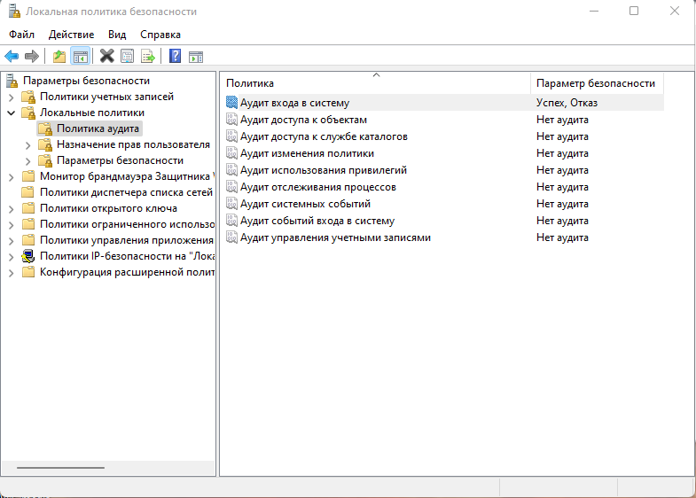
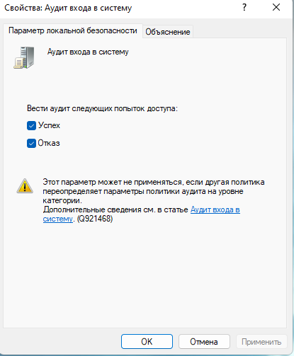
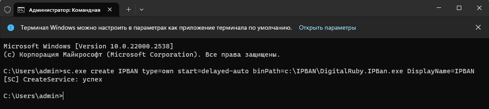
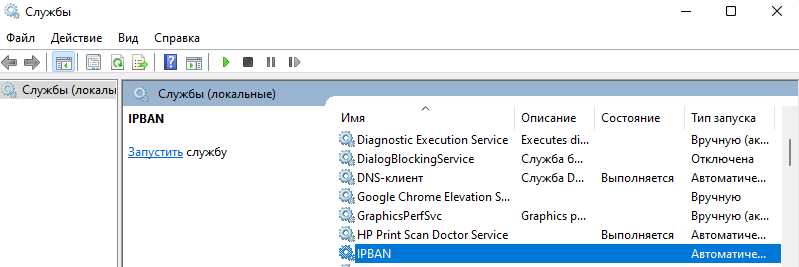
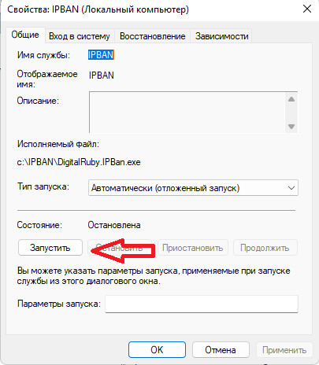
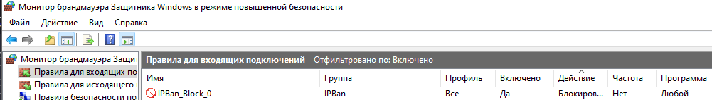

# Защита RDP с помощью IPBan

Защиту RDP от перебора паролей выполняется с помощью утилиты [IPBan](https://github.com/DigitalRuby/IPBan).

## Настройка локальной политики безопасности 
Для корректной работы IPban требуется настроить локальную политику безопасности. Для ее вызова нажимаем ++win+r++

Запускаем ее
```
secpol.msc
```
Параметры безопасности - Политика учетных записей - Аудит входа в систему. 



Ставим галочки на Успех и Отказ



## Установка IPBan

Скачанный zip архив с утилитой распоковываем  в каталог C:\IPBan  

С помощью утилиты sc.exe создаем новый сервис
```doscon
sc.exe create IPBAN type=own start=delayed-auto binPath=c:\IPBAN\DigitalRuby.IPBan.exe DisplayName=IPBAN
```
Результат


## Настройка IPban
В папке с установленным IPBan открываем файл ipban.config и находим строку 
```
<add key="Whitelist" value=""/>
```
и через запятую добавляем сети в белый список.

По желанию можно поменять количество неудачных попыток ввода. По умолчанию в файле 20.

```
<add key="FailedLoginAttemptsBeforeBanUserNameWhitelist" value="20"/>
```

Далее устанавливаем количество попыток ввода пароля  - 5. Если установить меньше, то программа все равно использует значение 5.
```
<add key="FailedLoginAttemptsBeforeBanUserNameWhitelist" value="5"/>
```

 По умолчанию время бана ip сутки

```
<<add key="BanTime" value="01:00:00:00"/>
```

Устанавливаем необходимое время бана. Например минуту
```
<add key="BanTime" value="00:00:01:00"/>
```

!!! note "Примечание"
    По умолчанию внутренние адреса не блокируются. Если нужно банить и внутренние адреса нужно найти строку 
    ``` 
    <add key="ProcessInternalIPAddresses" value="false"/>
    ```
    и поменять значение на true
    ``` 
    <add key="ProcessInternalIPAddresses" value="true"/>
    ```
Далее сохраняем файл с настройками.

Полный список параметров [конфигурационного файла.](https://github.com/DigitalRuby/IPBan/wiki/Configuration)
## Запуск IPBan
Для запуска IPban открываем оснастку службы. Для ее вызова нажимаем ++win+r++

Запускаем ее
```
services.msc
```
Находим созданную службу IPban 


и запускаем ее



!!! note "Примечание"
    Можно вместо графического интерфейса можно использовать командную строку
    ```doscon
    net start ipban
    ```
    или Powershell
    ```powershell
    Start-Service ipban
    ```
## Мониторинг

Если программа была установлена в папку C:\IPBan, то логи можно посмотреть в файле 
```
C:\IPBan\logfile.txt
```
В брандмауере Windows создается правило блокировки



Если открыть данное правило, и в нем вкладку область, то будет виден список заблокированных адресов. При необходимости адрес можно удалить, чтобы разблокировать пользователя. Если необходимо, то пользователя можно добавить в белый список в конфигурационном файле. 

## Принудительная блокировка и разблокировка

Вы можете вручную заблокировать IP-адреса, поместив файл Ban.txt в ту же папку, что и сервис IPBan. IP-адреса указаны в виде обычного текста, по одному IP-адресу в строке. В следующем цикле IPBan заблокирует каждый IP-адрес в файле, а затем удалит файл. Это отлично подходит для внешних приложений, таких как мониторы трафика, детекторы син-флуда и т. д., которым просто нужно вызвать блокировку IP-адреса.

Вы можете вручную разблокировать IP-адреса, поместив файл unban.txt в ту же папку, что и сервис IPBan. IP-адреса указаны в виде обычного текста, по одному IP-адресу в строке. В следующем цикле IPBan разблокирует любой IP-адрес в файле, а затем удалит файл. Каждый IP-адрес будет удален из базы данных брандмауэра и IPBan.